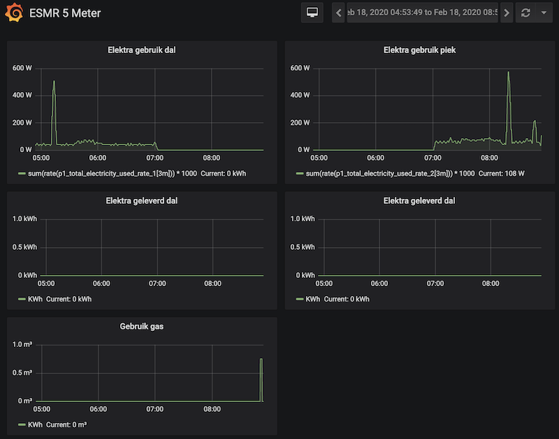

# Prometheus exporter for ESMR 5.0
> Smart Meter ESMR 5.0 Prometheus exporter

Currently for arm32v7 only.

## Run the exporter
To run in Docker:

For arm32v7
```
docker run \
    --detach \
    --name prometheus_esmr5 \
    --publish 8000:8000 \
    --device=/dev/ttyUSB0 \
    sbkg0002/prometheus_esmr5:arm32v7-latest
```
Or x86_64
```
docker run \
    --detach \
    --name prometheus_esmr5 \
    --publish 8000:8000 \
    --device=/dev/ttyUSB0 \
sbkg0002/prometheus_esmr5:amd64-latest
```
To view the logs:

```
[2020-02-17 19:22:31.838974] p1_total_electricity_used_rate_1: 460935.0
[2020-02-17 19:22:31.839388] p1_total_electricity_used_rate_2: 417854.0
[2020-02-17 19:22:31.839715] p1_total_electricity_provided_rate_1: 0.0
[2020-02-17 19:22:31.840107] p1_total_electricity_used: 275.0
[2020-02-17 19:22:31.840514] p1_total_electricity_provided: 0.0
[2020-02-17 19:22:31.841802] p1_total_gas_used: 798077.0
````

You can view the metrics at http://localhost:8000/metrics

## Dashboarding via Grafana




To create the dashboard in Grafana, just create a new dashboard with the json contents of `grafana_dashboard.json`.
